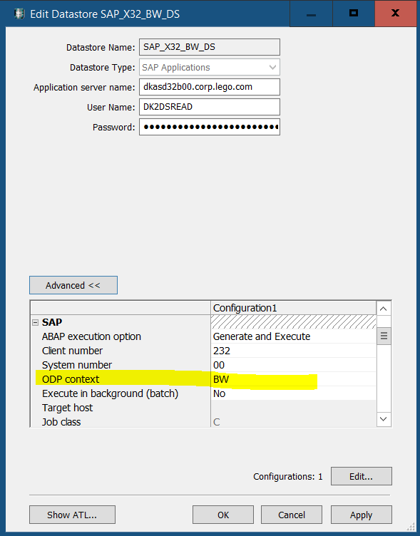

# Operational Data Provisioning (ODP) and Delta Queue (ODQ) based Extraction

Operational Data Provisioning (ODP) supports extraction and replication scenarios for various target applications and incorporates delta mechanisms in these scenarios. When dealing with a delta procedure, data from a source (referred to as the ODP Provider) is automatically written to a delta queue, known as the Operational Delta Queue (ODQ), through an update process or passed to the delta queue via an extractor interface. The ODQ effectively tracks new and modified records since the last extraction, facilitating incremental data updates.

## ODP Context or Provider

An ODP context represents a source of ODPs. Context identifiers are present for all technologies whose analytical views can be exposed as ODPs. Currently, the following ODP contexts are available (depending on release):

| Provider Name | Description                                                  |
|---------------|--------------------------------------------------------------|
| ABAP_CDS      | ABAP Core Data Services                                     |
| BW            | SAP NetWeaver / BW/4HANA                                   |
| BYD           | SAP Business ByDesign. Data from MDAV extracted via ODP. Implemented via SOAP Web Service. |
| ESH           | Search and operational analytics                            |
| HANA          | SAP HANA Information View                                   |
| SAPI          | SAP Service Application Programming Interface (S-API) for SAP DataSources |
| SLT~          | SAP Landscape Transformation Replication Server             |


In our extraction process, we will utilize the BW context and retrieve data from the ***BW DataStore***.


## ODP Subscribers or Consumers

Currently, the following subscriber types are available (depending on release):

| Subscribers       | Description                                        |
|-------------------|----------------------------------------------------|
| SAP_BW/4HANA      | SAP NetWeaver Business Warehouse                 |
| DS                | SAP Business Objects Data Services              |
| TREX_ES           | SAP NetWeaver Embedded Analytics. Query is defined on transient provider, derived from ODP |
| RODPS_REPL_TEST   | Created by executing report RODPS_REPL_TEST (in transaction SE38) |
| RSODP_ODATA       | Open Data Protocol (OData)                      |
| HANA_SDI          | SAP HANA Smart Data Integration                  |


We will be using ***SAP Data Services*** as consumer.

# SAP Data Services

Data Services has seamless integration capabilities with SAP ODP-enabled data sources. In Lego BW system, most of the objects are ODP enabled, and SAP Data Services can use extractors for data extraction through the ODP API framework.

1. To extract data from the BW system using extractors, you should have a Datastore configured as the source in Data Services with BW ODP context.

   

2. To import the required ODP-enabled object, follow these steps:
   * Double-click on the Datastore to view the list of ODP-enabled objects.
   * Identify the necessary ODP extractors from the list.
   * Right-click on the desired ODP extractor and choose the "Import" option.
3. **CDC Mode**: When importing any ODP, one can choose between query mode or CDC mode. Here we will use Change-data Capture (CDC) mode extractor. Each of these projects will be a separate subscription in the source system, which you can view in the T-CODE ODQMON.

4. Create a cloud storage file location to land the file in the landing S3 bucket. The team taking the role of the Data Producer has their own AWS Account. Refer to the baseplate document to bring your own bucket (Baseplate BYOB).

5. Create a Data Services job that uses an ODP (Operational Data Provisioning) object as the source and exports the data to a specified file location.


## CDC Mode

When importing any ODP, you can choose between query mode or CDC mode. Here, we will use Change-data Capture (CDC) mode extractor. Each of these projects will be a separate subscription in the source system, which you can view in the T-CODE ODQMON.

## Cloud Storage File Location

1. Create a cloud storage file location to land the file in the landing S3 bucket.
2. The team responsible for the Data Producer role has their own AWS Account.
3. Refer to the baseplate document to bring your own bucket (Baseplate BYOB).

## Data Services Job

1. Create a Data Services job that uses an ODP (Operational Data Provisioning) object as the source and exports the data to a specified file location.
2. If the initial load is set to 'Yes,' it will import all the data during the first execution.
3. Subsequently, for incremental loads, it should be set to 'No' after the initial execution.


# Implement CDC (Change Data Capture) Pipeline With Delta Lake

Delta Lake is designed to support CDC workloads by offering support for UPDATE, DELETE, and MERGE operations. Additionally, Delta tables can facilitate CDC to capture internal changes and propagate these changes downstream. When used in conjunction with Delta Lake, Autoloader enables the reading of incremental files from an S3 location and simplifies the process of upserting them into downstream Delta tables.

To enhance efficiency, we are moving away from using CSV storage for CDC information and opting to store it in a Delta table:
```python
checkpoint_path = "/Volumes/<catalog_name>/<schema_name>/<volume_name>/<sub_path_bronze_table>"
bronzeDF = (spark.readStream
    .format("cloudFiles")
    .option("cloudFiles.format", "CSV")
    .option("header", "true")
    .option("cloudFiles.schemaLocation", checkpoint_path)
    .load("s3://<landing-bucket>/<path-to-files>"))

(bronzeDF.writeStream
    .option("checkpointLocation", checkpoint_path)
    .trigger(availableNow=True)
    .toTable("<catalog_name>.<schema_name>.<cdc_bronze_table_name>"))
```
And run our MERGE statement to upsert the CDC information in our final table:
```python
sql_query = """
  MERGE INTO <silver_table_name> a
  USING stream_updates b
  ON a.<key_field> = b.<key_field>
  WHEN MATCHED AND b.<OPERATION_FIELD> = 'U' THEN UPDATE SET *
  WHEN NOT MATCHED AND b.<OPERATION_FIELD> = 'C' THEN INSERT *
```
For each batch / incremental update from the raw bronze table, we'll run a MERGE on the silver table
```python
def merge_stream(df, i):
  df.createOrReplaceTempView("stream_updates")
  df._jdf.sparkSession().sql(sql_query)
```

For finalizing the process, we create a silver table:
```sql
%sql
use catalog <catalog_name>;
use schema <schema_name>;
CREATE TABLE IF NOT EXISTS <silver_table_name> AS  SELECT * FROM <cdc_bronze_table_name> WHERE 1=2
```

```python
checkpoint_path = "/Volumes/<catalog_name>/<schema_name>/<volume_name>/<sub_path_silver_table>"
(spark
   .readStream.table("<cdc_bronze_table_name>")
   .filter("<filter_condition>")
   .writeStream
        .foreachBatch(merge_stream)
       .option("checkpointLocation", checkpoint_path_silver)
       .trigger(availableNow=True)
       .start())
```