# ***SAP BW Data Incremental Ingestion to LEGO Nexus***


## ***Prerequisites***

* Review the principles and guidelines to publish data from SAP BW to Lego Nexus outlined in<a href="https://baseplate.legogroup.io/docs/default/component/engineering-matters/data-matters/guidelines/03-data-office-bw-core-publication-guidelines/" target="_blank">
data-matters Baseplate</a> document.
* Data products should be registered using the data product registration template as described in the <a href="https://baseplate.legogroup.io/docs/default/component/self-service-core-data-platform/registration/#how-to-register-a-data-product" target="_blank">
registration guide</a> document.
* If a BI engineering product team doesn't have an application in <a href="https://lego.leanix.net/architecturegateway/dashboard/" target="_blank">Architecture Gateway</a>, they need to register one (or more if necessary) so that the source of the data is correctly represented and linked to the correct digital product. User <a href="https://legogroup.atlassian.net/wiki/spaces/ARC/pages/1651576072/How+to+-+Create+an+Application+in+Architecture+Gateway" target="_blank">guide</a> to Create an application in Architecture Gateway.
* Prior to commencing the implementation of the CDC pipeline in Databricks, it is essential to configure the S3 bucket and establish a connection by linking your S3 bucket through the External location. The process for bringing your own bucket, requesting storage credentials and external location for a S3 bucket is outlined in detail within the Baseplate <a href="https://baseplate.legogroup.io/docs/default/component/self-service-core-data-platform/ingestion/ingestion-patterns/byob" target="_blank">
BYOB</a> document.

## ***Architectural flow diagram***

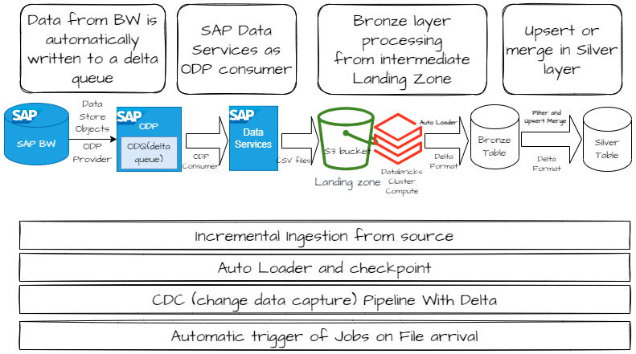

## ***Incremental Extraction and landing it in S3***
-----------------------------------------------------

### ***Operational Data Provisioning (ODP) and Delta Queue (ODQ) based Extraction :***

Operational Data Provisioning (ODP) supports extraction and replication scenarios for various target applications and incorporates delta mechanisms in these scenarios. When dealing with a delta procedure, data from a source (referred to as the ODP Provider) is automatically written to a delta queue, known as the Operational Delta Queue (ODQ), through an update process or passed to the delta queue via an extractor interface. The ODQ effectively tracks new and modified records since the last extraction, facilitating incremental data updates.

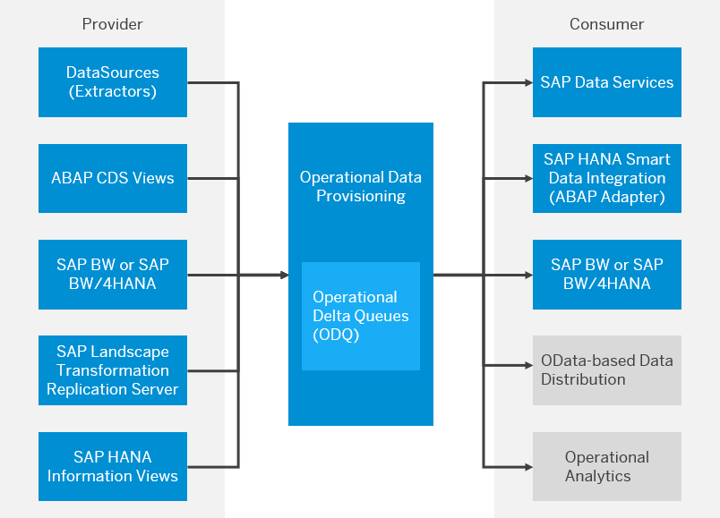

#### ***ODP Context or Provider***

An ODP context represents a source of ODPs. Context identifiers are present for all technologies whose analytical views can be exposed as ODPs. Currently, the following ODP contexts are available (depending on release):

| Provider Name | Description                                                  |
|---------------|--------------------------------------------------------------|
| ABAP_CDS      | ABAP Core Data Services                                     |
| BW            | SAP NetWeaver / BW/4HANA                                   |
| BYD           | SAP Business ByDesign. Data from MDAV extracted via ODP. Implemented via SOAP Web Service. |
| ESH           | Search and operational analytics                            |
| HANA          | SAP HANA Information View                                   |
| SAPI          | SAP Service Application Programming Interface (S-API) for SAP DataSources |
| SLT~          | SAP Landscape Transformation Replication Server             |


In our extraction process, we will utilize the BW context and retrieve data from the ***BW DataStore***.


#### ***ODP Subscribers or Consumers***

Currently, the following subscriber types are available (depending on release):

| Subscribers       | Description                                        |
|-------------------|----------------------------------------------------|
| SAP_BW/4HANA      | SAP NetWeaver Business Warehouse                 |
| DS                | SAP Business Objects Data Services              |
| TREX_ES           | SAP NetWeaver Embedded Analytics. Query is defined on transient provider, derived from ODP |
| RODPS_REPL_TEST   | Created by executing report RODPS_REPL_TEST (in transaction SE38) |
| RSODP_ODATA       | Open Data Protocol (OData)                      |
| HANA_SDI          | SAP HANA Smart Data Integration                  |


***SAP Data Services*** will be the consumer here.

### ***Extraction using SAP Data Services :***

Data Services has seamless integration capabilities with SAP ODP-enabled data sources. In Lego BW system, most of the BW data store objects(DSO) are ODP enabled, and SAP Data Services can use extractors for data extraction through the ODP API framework.

1. To extract data from the BW system using extractors, you should have a Datastore configured as the source in Data Services with BW ODP context.<br><br>
2. To import the required ODP-enabled object, follow these steps:
   <ul>
      <li>Double-click on the Datastore to view the list of ODP-enabled objects.</li>
      <li>Identify the necessary ODP extractors from the list</li>
      <li>Right-click on the desired ODP extractor and choose the "Import" option.</li>
   </ul>
      

3. During import provide the consumer name and project name and **CDC Mode**. When importing any ODP, one can choose between query mode or CDC mode. For incremental extraction choose CDC. Each of these projects will be a separate subscription in the source system, which you can view in the T-CODE ODQMON.
   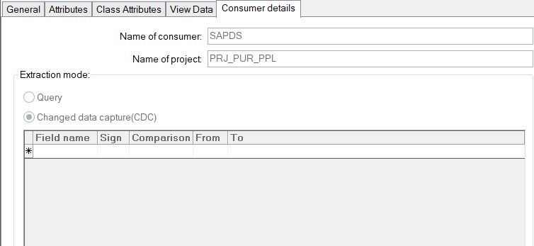
   <br>
4. If the file location isn't already created for that S3 landing bucket then reate a ***cloud storage file location*** to land the file in the landing S3 bucket. The team taking the role of the Data Producer has their own AWS Account.
   <ul>
      <li>If the S3 bucket for landing data hasn't been created yet, please refer to the 'Create AWS Bucket' section in the Baseplate <a href="https://baseplate.legogroup.io/docs/default/component/self-service-core-data-platform/ingestion/ingestion-patterns/byob" target="_blank">BYOB</a> document.</li>
      <li>Create an IAM user in the AWS account and Set permissions to read and write into S3 bucket</li>
      <li>Create Access key for that IAM user and copy Secrest key value, provide the details in Data Services file location.</li>
      <li>Click 'Apply' to test the connection</li>      
   </ul>

      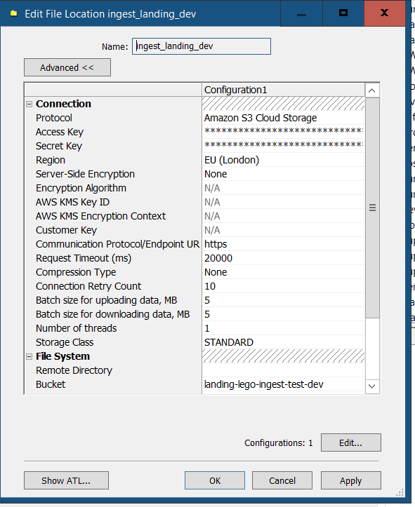

5. Before the DataFlow, a scipt can be used to create CSV file names with a dynamic timestamp.<br>
   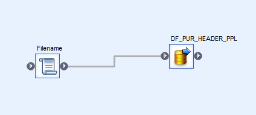<br>
   Data Services script<br>
   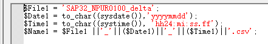

6. Create a Data Services data flow that uses an ODP (Operational Data Provisioning) object as the source and exports the data to a specified file location.<br>
   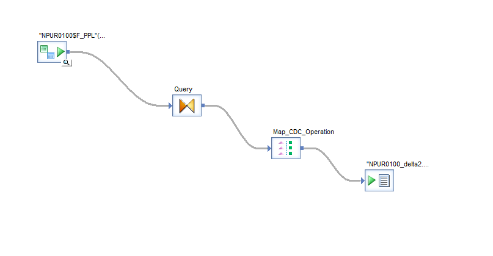

7. The way we use MAP CDC Operation depends on what we need – whether to send all the changes that happened over time or just the current information. This choice is based on the type of extractor we're using.<br>
   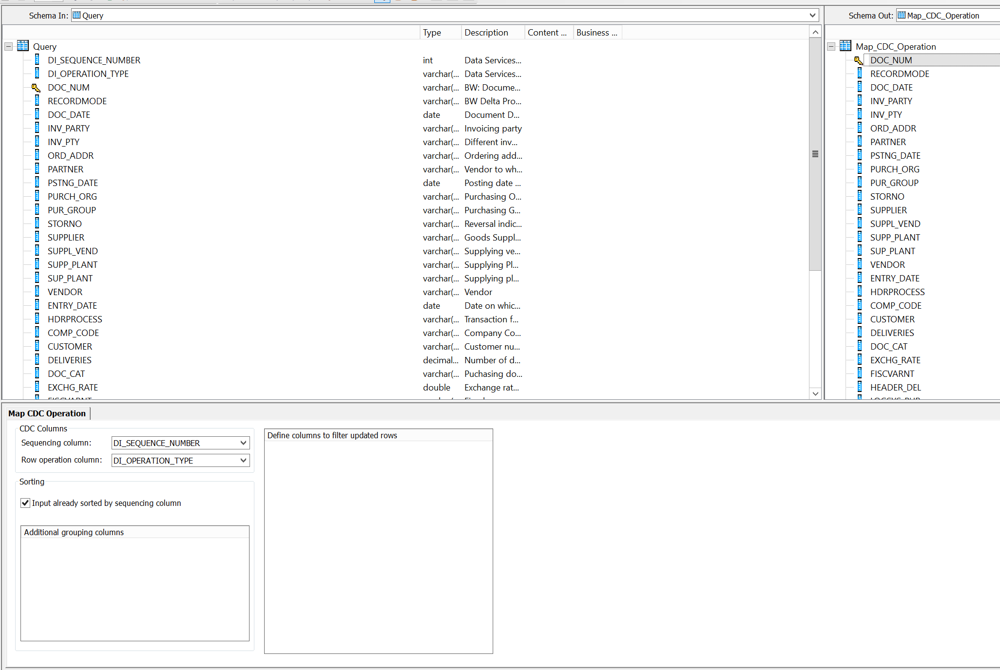

8. The "File name(s)" points output of the script in the step no 5 to create a dynamic file name with a timestamp ($Name1)<br>
   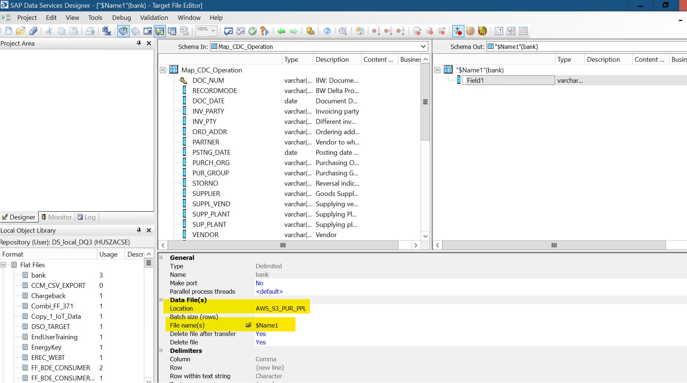

9. If the ***initial load*** is set to 'Yes,' it will import all the data during the first execution. Subsequently, for incremental loads, it should be set to 'No' after the initial execution.<br>
   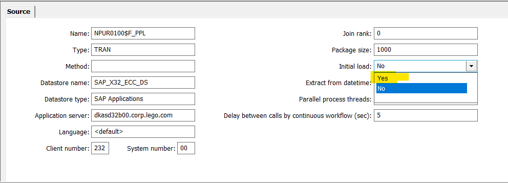

10. The sample output file contains a column labeled ***ODQ_CHANGEMODE***, serving as an indicator for operational types. The potential values include:<br>
      ***C*** - New Record <br>
      ***U*** - Updated Record <br>
      ***D*** - Deleted Record <br>

      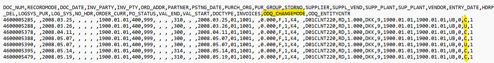


## ***Data Load into LEGO Nexus Bronze table from S3***
----------------------------------------------------
### ***Implement CDC (Change Data Capture) Pipeline With Delta Lake :***

Delta Lake is designed to support CDC workloads by offering support for UPDATE, DELETE, and MERGE operations. Additionally, Delta tables can facilitate CDC to capture internal changes and propagate these changes downstream. When used in conjunction with Delta Lake, Autoloader enables the reading of incremental files from an S3 location and simplifies the process of upserting them into downstream Delta tables.

To enhance efficiency, we are moving away from using CSV storage for CDC information and opting to store it in a Delta table. For example, below code will ingest the incremental files from the S3 location to a bronze table using Autoloader: 
```python
checkpoint_path = "/Volumes/<catalog_name>/<bronze_schema_name>/<volume_name>/<sub_path_bronze_table>"
bronzeDF = (spark.readStream
    .format("cloudFiles")
    .option("cloudFiles.format", "CSV")
    .option("header", "true")
    .option("cloudFiles.schemaLocation", checkpoint_path)
    .load("s3://<landing-bucket>/<path-to-files>"))

(bronzeDF.writeStream
    .option("checkpointLocation", checkpoint_path)
    .trigger(availableNow=True)
    .toTable("<catalog_name>.<bronze_schema_name>.<cdc_bronze_table_name>"))
```

Define the ***MERGE*** statement to upsert the CDC information in our final table. Please be aware that the use of "DELETE" is discretionary; only employ it when an actual deletion is occurring at the source. Alternatively, if the source incorporates an active or inactive flag, the "UPDATE" action will adequately address the situation.
```python
sql_query = """
  MERGE INTO <silver_table_name> a
  USING stream_updates b
  ON a.<key_field> = b.<key_field>
  WHEN MATCHED AND b.<OPERATION_FIELD> = 'U' THEN UPDATE SET *
  WHEN NOT MATCHED AND b.<OPERATION_FIELD> = 'C' THEN INSERT *
  WHEN MATCHED AND b.<OPERATION_FIELD> = 'D' THEN DELETE
```
For each batch / incremental update from the raw bronze table, this function will run a MERGE on the silver table.
```python
def merge_stream(df, i):
  df.createOrReplaceTempView("stream_updates")
  df._jdf.sparkSession().sql(sql_query)
```

For finalizing the process, create a silver table:
```sql
%sql
use catalog <catalog_name>;
use schema <silver_schema_name>;
CREATE TABLE IF NOT EXISTS <silver_table_name> AS  SELECT * FROM <bronze_schema_name>.<cdc_bronze_table_name> WHERE 1=2
```
Retrieve data from the bronze table with delta changes Upsert-Merge it into the silver table using the previously defined merge_stream function:
```python
checkpoint_path = "/Volumes/<catalog_name>/<silver_schema_name>/<volume_name>/<sub_path_silver_table>"
(spark
   .readStream.table("<cdc_bronze_table_name>")
   .filter("<filter_condition>")
   .writeStream
        .foreachBatch(merge_stream)
       .option("checkpointLocation", checkpoint_path_silver)
       .trigger(availableNow=True)
       .start())
```
